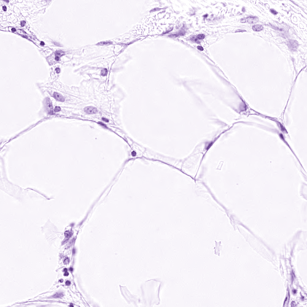
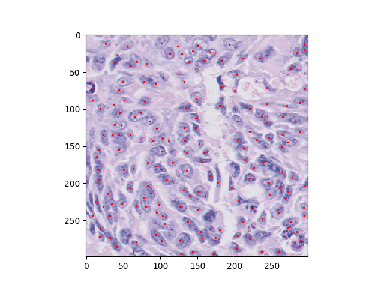

# SC-CNN

## Table of Contents

* [About the Project](#about-the-project)
  * [Dataset](#dataset)
  * [Code](#code)
* [Prerequisites](#Prerequisites)
* [Installation](#Installation)
* [Contact](#contact)


## About The Project

In this code, we try to implement the [Locality Sensitive Deep Learning for Detection and Classification of Nuclei in Routine Colon Cancer Histology Images](https://ieeexplore.ieee.org/document/7399414).

Note: We are updating the codes. It is not complete, and for this phase, the first part `SC-CNN` is implemented.
Thanks Profs. Rajpoot and Ahmed Raza for helping on the code.

### Dataset

The data for this code is same as the dataset which is mentioned in the [paper](https://ieeexplore.ieee.org/document/7399414). 
There are other datasets which can be used to train the model too. We will update the code for that concern, but for now we are just using the main dataset.

Note: There is no need to download the data. Everything is handled by codes.

### Code

The code is written using `Pytorch`. It is compatible with running on CPU or GPU.

You can run it on multiple GPUs too, but you have to determine this in `--gpu` when you want to run the file. See the [training](#training) for more info.

#### Training

At first, the dataset, which is described in this [part](#dataset), is downloaded. 
The origin coordinates of centers are in .mat files. Since we want to use it for multiple datasets, coordinates are re-written in .txt files.

Then the H-channel is extracted using `Vahadane` color normalization method. It is implemented based on the [Matlab version](https://github.com/abhishekvahadane/CodeRelease_ColorNormalization).

 
The left one is original image, and the right one is after H-channel of the original image.

The patches are extracted from H-channel and feeded to the network.

You can see the parser arguments with:

`python /path/to/main.py -h`

The structure of model is written is 3 versions:
1. In version `0`, which is the same as one in the paper, takes the gray image of H-channel as input. 
2. In version `1`, the only difference with the version 0 is that it takes the RGB image of H-channel as input. 
3. Version `2` is completely different. The input has 4 channels which consists of gray image of H-channel + RGB image of H&E slides. Also, in this version, all the layers are convolutional ones. For training, you can run:

`python /path/to/main.py --patch_size PATCH_SIZE --stride_size STRIDE_SIZE --heatmap_size HEATMAP_SIZE --mode train --batch_size BATCH_SIZE --version VERSION_NUMBER --save NAME_SAVING --log_dir LOG_DIR --epoch NUM_EPOCH --num_worker NUM_WORKER`

#### Testing

For testing, you need to determine the weights and a directory where the images are located. The model will predict cells for each image.

`python /path/to/main.py --patch_size PATCH_SIZE --stride_size STRIDE_SIZE --heatmap_size HEATMAP_SIZE --mode test --version VERSION_NUMBER --load NAME_SAVED_WEIGHT.pt --num_worker NUM_WORKER --test_dir IMAGES_DIR`

The calculated centers of cells will be placed in `Datasets/Test/Center_Points` directory.

#### Visualization

For visualizing the predicted cells, you could run `visulize_cells.py`.

`python /path/to/visulize_cells.py --image PATH_TO_IMAGE --center PATH_TO_CALCULATED_CENTER --label PATH_TO_TRUE_CENTER`

The third argument (label) is not necessary, and it will show the true centers (annotated) of cells.
The blue dots are true centers, and red ones are predicted.



## Prerequisites
- Linux or macOS
- Python 3.7
- PyTorch 1.4.0+cu100
- NVIDIA GPU + CUDA CuDNN

## Installation

- Clone this repo
```
mkdir cell_detection
cd cell_detection
git clone https://github.com/AIMLab-UBC/SC-CNN
cd SC-CNN
```

- Install the required packages
    - `pip install torch==1.4.0+cu100 torchvision==0.5.0+cu100 -f https://download.pytorch.org/whl/torch_stable.html`
    - `pip install -r requirements.txt`

## Contact

If you have any question regarding the code, feel free to contact us. You can either create an issue or contacting us by an email. 
